# 🍽️ Sachivalay Canteen

A digital food ordering and canteen management solution developed for the **Gujarat Government SSIP Hackathon**.

The system was designed to digitize the traditional canteen ordering process at Sachivalay by providing an employee-facing mobile application for browsing food, placing orders, managing a digital wallet, making payments, and viewing order history.

> 🏆 **1st Prize — Gujarat Government SSIP Hackathon**
>
> Selected as the winning team among **2,500+ teams across Gujarat**.

---

## 📱 Application Preview

The employee application was developed using **React Native** to provide a convenient mobile experience for Sachivalay employees.

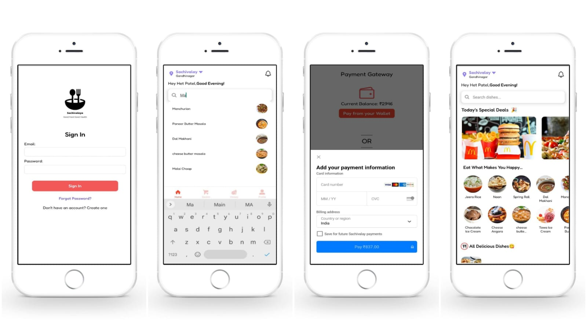

---

## 🎯 Problem Statement

### Online Order Canteen System

Traditional canteen operations involved manual ordering, paper-based bills, and maintaining physical records.

The proposed system aimed to digitize these operations by allowing employees to order food through a mobile application while providing dedicated web interfaces for canteen managers and administrators.

The complete system consisted of three major entities:

- 👨‍💼 **Employee** — Mobile application
- 🍽️ **Canteen Manager** — Web application
- 🛠️ **Admin** — Web application

---

## 💡 Solution

The solution connects employees, the canteen, and administrators through a centralized digital system.

### Employee Mobile Application

Employees can:

- 🔐 Log in to the application
- 🍽️ Browse the digital food menu
- 🔎 Search for dishes
- ⭐ View food details and ratings
- 🛒 Select quantities and add items to the basket
- 📦 Place food orders
- 💰 Use their digital wallet
- 💳 Make online payments when required
- 📜 View order history
- ❤️ Manage favourite orders
- 🔔 Access notifications
- 👤 Manage their profile
- 💬 Provide feedback

### Canteen Management

The wider system allows the canteen manager to:

- Add new food items
- Modify existing food items
- Delete food items
- View current orders
- View order history
- Manage wallet information
- Track revenue

### Administration

The admin side provides management capabilities including employee registration and monitoring of the canteen operation.

---

# 📱 Employee Mobile Application

The mobile application is the primary component of this repository and was developed for Sachivalay employees.

## 🏠 Home & Food Discovery

The home screen provides a food discovery experience with:

- 📍 Location information
- 🔎 Search
- 🎉 Special deals
- 🍴 Food categories
- 🍕 Food items
- 🔔 Notifications
- Navigation to different sections of the application

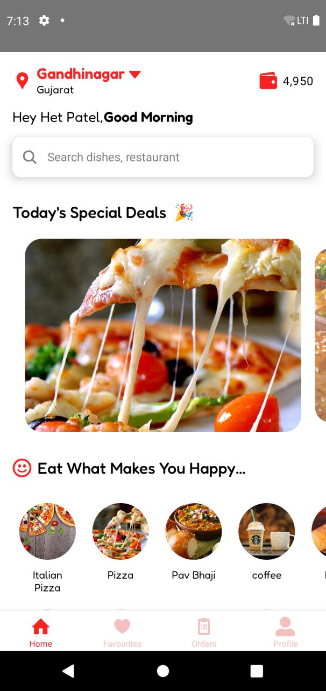

### Alternative Home Screen


---

## 🍕 Food Menu

Employees can browse available dishes along with:

- Food category
- Vegetarian/non-vegetarian indicator
- Ratings
- Number of ratings
- Price
- Availability
- Add-to-basket controls

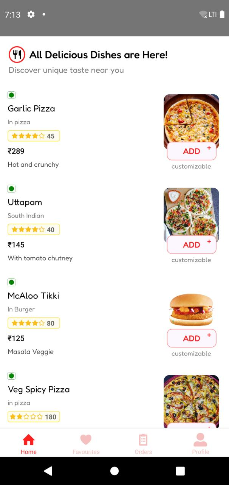

### Detailed Food Listing

The application also distinguishes unavailable food items from available items while displaying their prices and ratings.

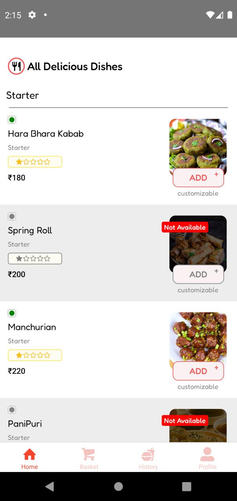

---

## 🍔 Food Details

Each food item has a dedicated details screen where employees can view the item, its rating, preparation time, category, and dietary information.

Employees can select the required quantity before adding the item to their basket.

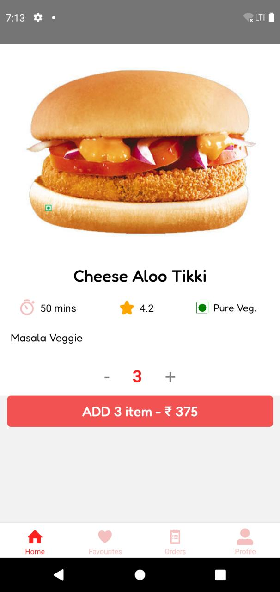

---

## 🛒 Basket & Order Creation

The basket displays:

- Selected food items
- Quantities
- Individual prices
- Total order amount

Employees can review their order before proceeding to payment.

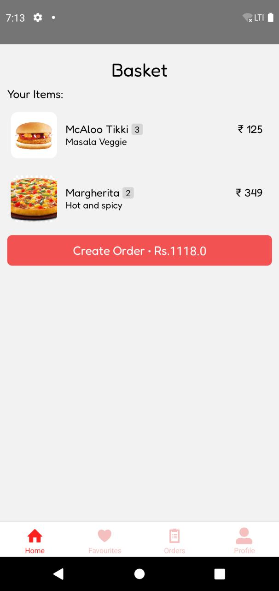

---

# 💳 Payment & Digital Wallet

The application incorporates a digital wallet-based payment flow.

Employees can view their current wallet balance and use the available balance when sufficient funds are available.

The project also included an online payment flow for situations where the wallet balance was insufficient.


### Payment Flow

```text
Select Food
     ↓
Add to Basket
     ↓
Create Order
     ↓
Check Wallet Balance
     │
     ├── Sufficient Balance
     │        ↓
     │    Pay from Wallet
     │
     └── Insufficient Balance
              ↓
        Online Payment
              ↓
        Order Processing
              ↓
         Notification
```

### Online Payment

The project prototype also included an online payment interface alongside the wallet-based payment option.

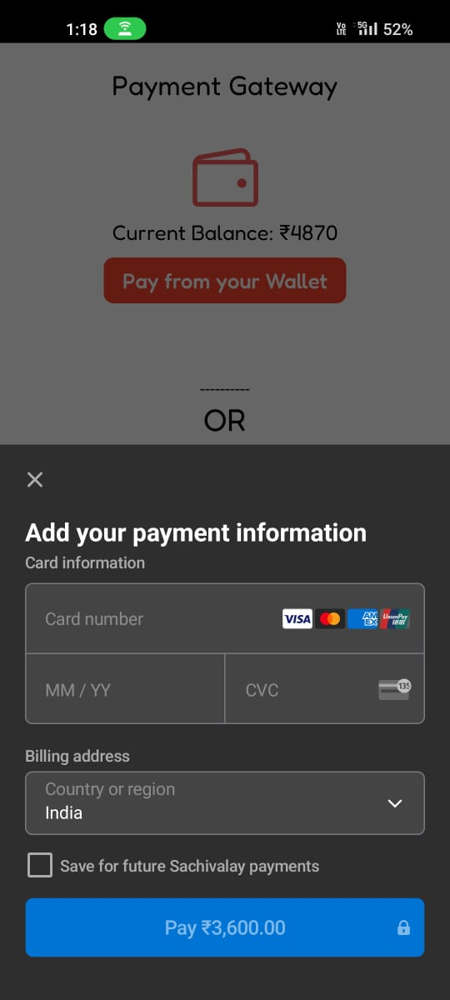

---

# 👤 Profile & Account Management

The profile section provides access to:

- Employee information
- Wallet balance
- Transaction history
- Notifications
- Settings
- Food orders
- Favourite orders
- Feedback
- About section
- Logout

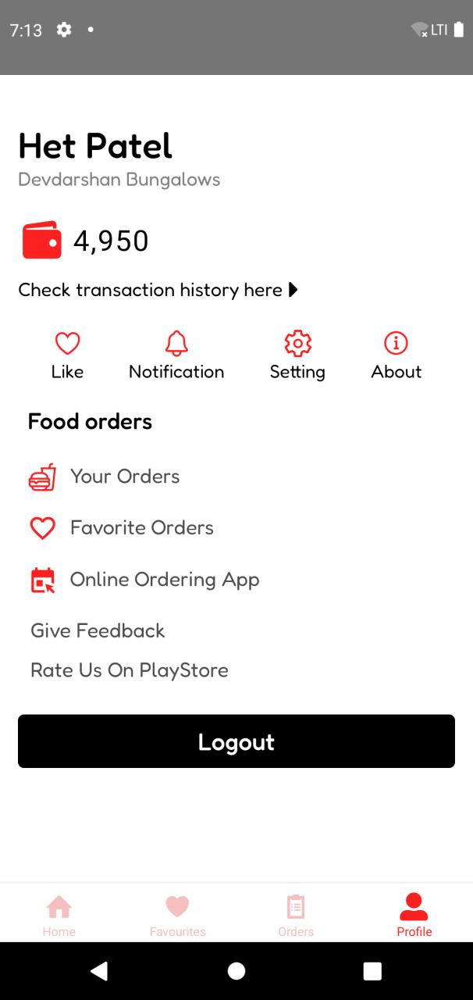

---

# 🔄 Employee Workflow

The employee-side workflow was designed around a simple ordering process.

```text
Start
  ↓
Login
  ↓
┌─────────────────────────────┐
│ Order / Wallet / History    │
└─────────────────────────────┘
  │
  ├── Wallet → View Balance
  │
  ├── History → View Orders
  │
  └── Order
        ↓
     Select Food
        ↓
     Make Order
        ↓
   Check Wallet Balance
        │
        ├── Sufficient
        │       ↓
        │   Pay from Wallet
        │
        └── Insufficient
                ↓
          Online Payment
                ↓
          Notification
                ↓
           Food Rating
                ↓
               Stop
```

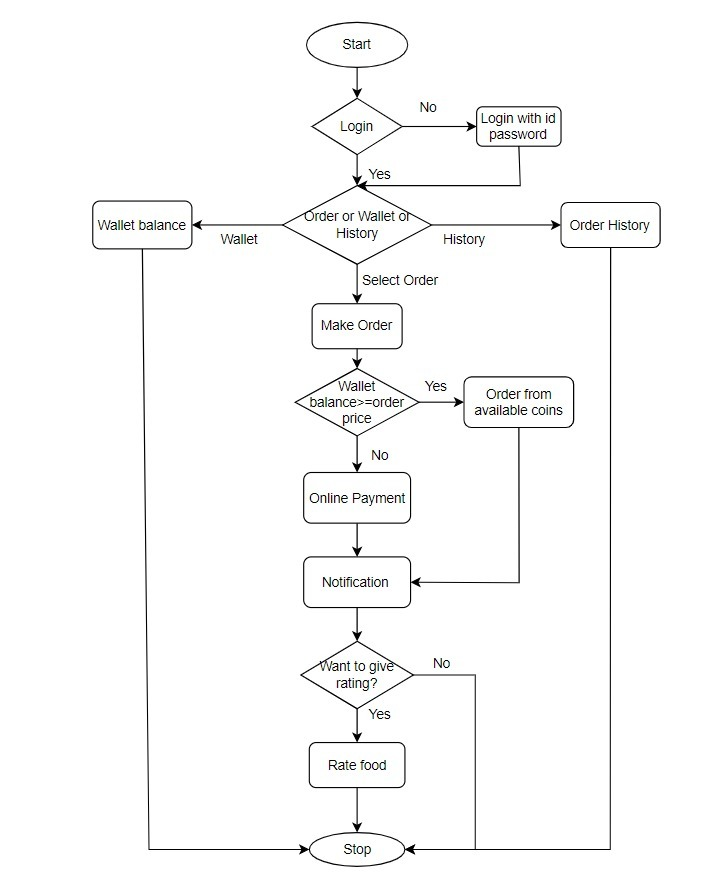

---

# 🏗️ Overall System Architecture

The complete project consisted of an employee mobile application together with web-based modules for canteen management and administration.

```text
                         Sachivalay Canteen System
                                  │
              ┌───────────────────┼───────────────────┐
              │                   │                   │
              ▼                   ▼                   ▼
          Employee          Canteen Manager         Admin
              │                   │                   │
              ▼                   ▼                   ▼
       React Native App       Web Application      Web Application
              │                   │                   │
              └───────────────────┼───────────────────┘
                                  │
                                  ▼
                             Backend APIs
                                  │
                                  ▼
                              Database
```

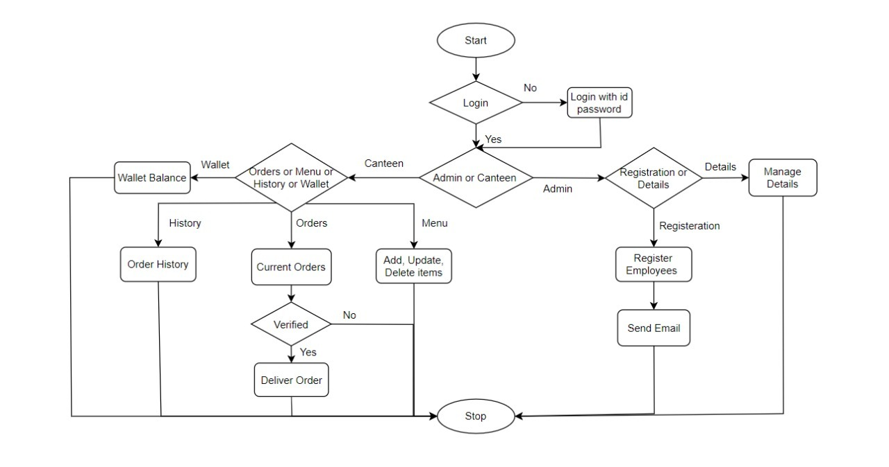

---

# 🖥️ Canteen Management

The wider system included a web interface for canteen management.

The canteen dashboard provides an overview of users, current orders, wallet information, sales, and revenue trends.

The canteen manager can also view and manage incoming orders.

---

# 🔐 Authentication

The employee application includes an authentication flow for accessing the mobile application.


---

# 📱 Complete Food Ordering Flow

The complete employee ordering experience can be summarized as:

```text
Sign In
   ↓
Home
   ↓
Browse Food
   ↓
Food Details
   ↓
Select Quantity
   ↓
Add to Basket
   ↓
Review Order
   ↓
Payment
   ↓
Order Processing
   ↓
Order History
```

This flow brings food discovery, ordering, wallet/payment, and order management together in a single mobile experience.

---

# 🛠️ Technology Stack

## Mobile Application

- **React Native**
- **JavaScript**
- **React Navigation**
- **Axios**
- **AsyncStorage**
- **React Hook Form**
- **Stripe React Native**
- **Lottie**
- **React Native Gesture Handler**
- **React Native Vector Icons**

## Overall System

The broader project was developed using:

- **React Native** — Employee mobile application
- **React.js** — Web application
- **Node.js** — Backend
- **Express.js** — REST APIs
- **MongoDB** — Database
- **AWS** — Backend infrastructure and hosting

---

# 🧩 Key Features

## Employee Mobile App

- 🔐 Employee authentication
- 🍽️ Digital food menu
- 🔎 Food search
- 🎉 Special deals and food categories
- ⭐ Food ratings
- 🛒 Basket management
- 💰 Digital wallet
- 💳 Online payment
- 📦 Food ordering
- 📜 Order history
- ❤️ Favourite orders
- 🔔 Notifications
- 👤 Profile management
- 💬 Feedback

## Canteen & Administration

- 👨‍💼 Employee management
- 🍴 Food/menu management
- 📋 Current order management
- 💰 Wallet management
- 📊 Revenue dashboard
- 📈 Sales monitoring
- 📜 Order history

---

# 🚀 Project Outcome

The project was developed as a solution to a real-world government canteen digitization problem.

The employee application was released through **Google Play** during the project period.

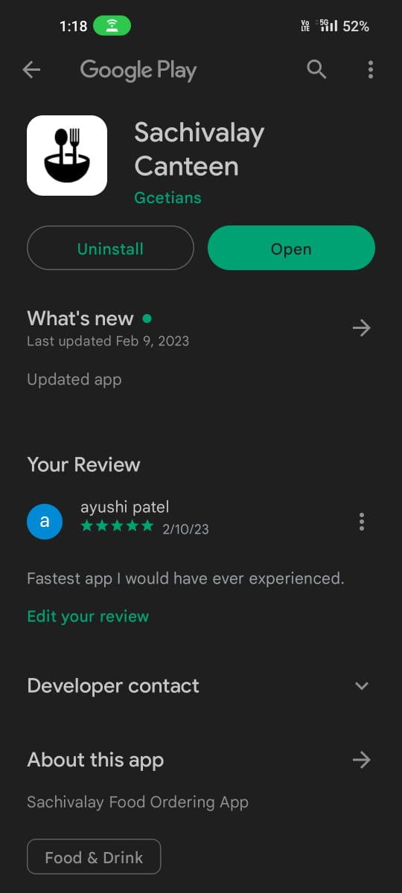

The published application received positive feedback during its release period.

---

# 🏆 Recognition

## Gujarat Government SSIP Hackathon

### 🥇 1st Prize

The project was selected as the winning solution among **2,500+ participating teams across Gujarat**.

The project focused on using technology to digitize canteen operations and simplify food ordering for government employees.

---

# 👨‍💻 My Contribution

I primarily worked on the **employee-facing mobile application**.

My work included:

- Developing the React Native mobile application
- Building the food discovery and menu experience
- Implementing food details and quantity selection
- Developing basket and order creation flows
- Implementing wallet-based payment functionality
- Integrating the online payment flow
- Implementing order history and profile functionality
- Integrating the mobile application with backend APIs
- Contributing to the overall system design and project development

---

# 📚 Project Background

**Project:** Sachivalay Canteen — Online Order Canteen System  
**Program:** Gujarat Government SSIP Hackathon  
**Duration:** January 2023 – March 2023  
**Role:** Mobile Application Development  
**Primary Technology:** React Native  
**Recognition:** 1st Prize among 2,500+ teams across Gujarat

---

# 📸 Additional Application Screenshots

### Home — Alternative UI

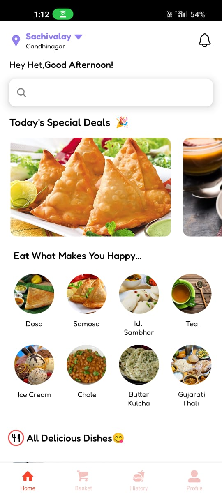

### Food Listing


### Food Details


### Basket


### Profile


### Payment

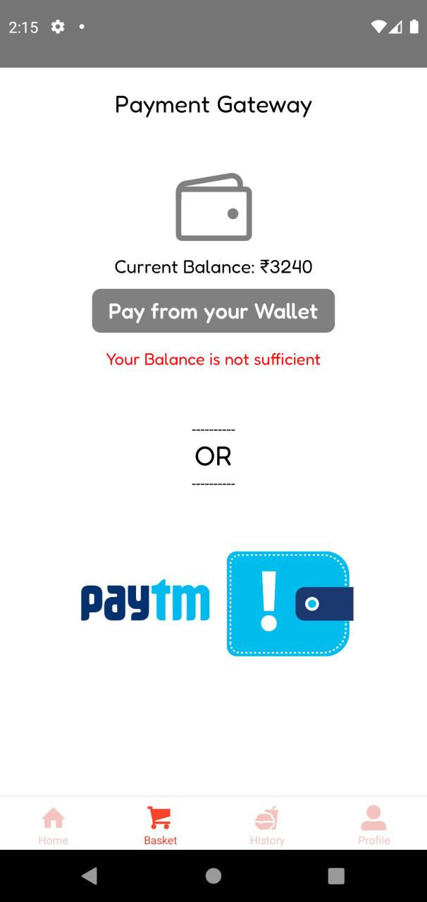

---

# 📁 Project Structure

The repository contains the original project modules, including the employee mobile application and the web/backend components developed as part of the complete SSIP solution.

```text
ssip/
│
├── UserMobile/          # Employee React Native application
├── Website Module/      # Web application
├── admin/               # Administration module
├── auth/                # Authentication/backend module
├── canteen/             # Canteen management module
├── payment/             # Payment-related module
├── user/                # User-related backend module
├── django/              # Backend project components
│
├── screenshots/
│   ├── mobile/
│   └── architecture/
│
└── README.md
```

---

# 🎯 Why This Project Matters

The project was built around a practical problem rather than being only a demonstration application.

It combines:

- Mobile application development
- REST API integration
- Payment workflows
- Digital wallet management
- Order processing
- Database-backed food catalogues
- Role-based system components
- Web and mobile interfaces
- Cloud-based backend infrastructure

The project also provided an opportunity to develop and demonstrate a complete software solution for a real-world government use case.

---

# 🏆 From Problem Statement to Product

```text
Government Canteen Problem
          ↓
      SSIP Hackathon
          ↓
     System Design
          ↓
 React Native Mobile App
          ↓
 Food Discovery & Ordering
          ↓
 Wallet & Online Payment
          ↓
 Canteen Management
          ↓
    Working Product
          ↓
   🥇 1st Prize
```

---

## 📂 Screenshot Files

The README references the following screenshots:

```text
screenshots/
├── app-overview.jpg
├── sign-in.jpg
├── home.jpg
├── home-alternative.jpg
├── menu.jpg
├── food-list.jpg
├── food-details.jpg
├── basket.jpg
├── profile.jpg
├── payment.jpg
├── payment-alternative.jpg
├── online-payment.jpg
├── play-store.jpg
├── employee-flow.jpg
├── system-flow.jpg
```
